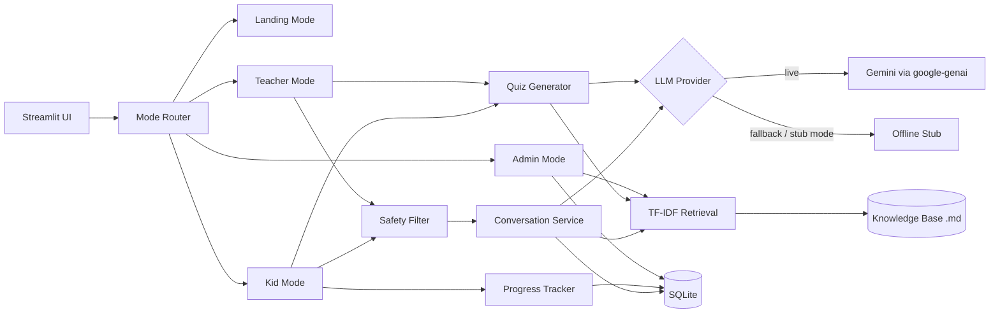

# KinderAi Product and Architecture Notes

KinderAi is a modular AI learning assistant for the **MajuBarengAi programme by Hacktiv8 with Google**.

## Purpose

KinderAi provides a safe learning assistant that supports:

- simple question answering, grounded in curated lesson notes,
- retrieval over a local knowledge base,
- lesson planning for teachers,
- quiz generation and scoring,
- learner progress tracking (lessons, badges, levels),
- read-aloud support, and
- admin supervision (logs, progress, configuration, knowledge base).

## Design principles

### 1. Shared backend
All modes call the same `ConversationService`, so safety checks, retrieval, and provider selection behave consistently everywhere.

### 2. Mode-specific UI and persona
Each audience gets a different screen, a different visual theme, and a different system-prompt persona (`app/core/conversation.py`'s `_MODE_INSTRUCTIONS`).

### 3. Safe, degrade-gracefully defaults
Kid Mode prompts are screened before any model call. If the live provider errors, the app falls back to a deterministic stub rather than failing.

### 4. Configuration by environment
Secrets and environment-specific values live in `.env` / platform secrets, never in code. `app/config.py` is the single source of truth and resolves relative paths against the project root.

### 5. Simple local persistence
SQLite is enough for this stage and keeps setup easy. The schema covers conversations, learner progress, quiz attempts, and app settings.

### 6. Dependency-light "real AI"
Retrieval is a small, pure-Python TF-IDF index (no `chromadb`/`faiss`/embedding API). The LLM layer is one optional dependency (`google-genai`) with an always-available offline stub.

## Current architecture



## Key modules

- `app/main.py` -- Streamlit entry point; loads `.env`, initializes/seeds the database, applies the shared + mode-specific CSS theme, and renders the sidebar (mode picker, live/stub status, knowledge-base count).
- `app/config.py` -- reads and validates environment settings into a frozen, hashable `AppSettings`. Exposes `has_real_gemini_key` and `is_live`.
- `app/core/router.py` -- selects the right UI mode.
- `app/core/conversation.py` -- `ConversationService`: runs the safety check, retrieves snippets (Kid/Teacher), builds the mode-specific system prompt, calls the provider, and falls back to the stub on error. Cached per-settings via `get_conversation_service`.
- `app/core/providers/` -- `LLMProvider` interface, `GeminiProvider` (google-genai), `StubProvider` (deterministic, offline, RAG-aware), and the `get_provider` factory.
- `app/core/rag/` -- `KnowledgeDocument`, `VectorIndex` (TF-IDF + cosine similarity, JSON-serializable), `load_knowledge_base`, `get_index`/`rebuild_index`/`retrieve_approved_snippets`.
- `app/core/quiz/` -- `QuizQuestion`, `generate_quiz` (live JSON generation with an offline fallback that's grounded in retrieved snippets).
- `app/core/progress/` -- `ProgressSummary`, `compute_progress_score`, `level_for_score`, `next_level_target`.
- `app/core/safety/` -- keyword-based screening for Kid Mode (self-harm, violence, sexual content, drugs/alcohol, personal information).
- `app/core/speech/` -- `text_to_speech_html` (browser `SpeechSynthesis`, no dependencies).
- `app/db/database.py` -- SQLite access: conversations, learner progress, quiz attempts, app settings, idempotent demo seeding.
- `app/modes/` -- the four Streamlit screens.

## Gemini provider

The repository defaults to a safe, offline stub:

```dotenv
GEMINI_API_KEY=
GEMINI_USE_STUB=true
```

`app/core/providers/get_provider` returns `StubProvider` whenever `settings.is_live` is `False` (stub enabled, or the key is empty/a known placeholder). When live, `GeminiProvider` wraps `google-genai`'s `client.models.generate_content`, passing the mode-specific system instruction, the safety-checked prompt, retrieved snippets (as context), `GEMINI_MODEL`, and `GEMINI_MAX_OUTPUT_TOKENS`. Any exception (bad key, network error, empty/blocked response) is captured as `ProviderResponse.error`; `ConversationService` then re-runs the same call through `StubProvider` and sets `ConversationResponse.notice` so the UI can explain the degradation.

This means switching providers, models, or going live/offline is a configuration change only -- no UI or routing code changes.

## Data flow

1. The user opens a mode from the sidebar (or a landing-page button).
2. Kid/Teacher Mode: the prompt passes through `check_prompt_safety`. If blocked, a safe canned refusal is returned immediately.
3. For Kid/Teacher Mode, `retrieve_approved_snippets` searches the TF-IDF index over `app/data/knowledge_base/*.md` and returns up to 3 snippets above a relevance threshold.
4. `ConversationService` builds a system instruction (persona + safety rules + learner context + retrieved snippets) and calls the active `LLMProvider`.
5. The response, sources, and any fallback notice are shown to the user and logged to SQLite.
6. In Kid Mode, "Quiz me on this!" generates a short quiz (via the same provider/fallback logic); checking answers records a `quiz_attempts` row and updates `learner_progress` (completion + badges).
7. Admin Mode reads all of the above from SQLite and from the live retrieval index.

## Status vs. original starter

Most items from the original "suggested next expansion" are now implemented:

- [x] Replace stub responses with a real Gemini client adapter (with automatic fallback).
- [x] Add retrieval over trusted lesson content only.
- [x] Add tests for safety rules, retrieval, quizzes, providers, conversation, and database writes (50 tests in `tests/`).
- [x] Quiz generation and scoring.
- [x] Learner progress tracking and levels.
- [x] Read-aloud (text-to-speech).
- [ ] Exportable reports for teachers and admins beyond the per-quiz Markdown download.

## Suggested next expansion

- **Speech-to-text.** Gemini accepts audio input directly; a future version could let kids upload/record a short clip in Kid Mode and send it to `GeminiProvider` for transcription, avoiding a fragile custom JS component.
- **Semantic retrieval.** Swap or augment the TF-IDF index with Gemini embeddings for better recall on paraphrased questions, while keeping the current index as an offline fallback.
- **Accounts.** Learner identity is currently just a free-text name (`LearnerProfile`). A real account system would prevent name collisions and enable per-learner history across devices.
- **Localization.** Given the programme's audience, Bahasa Indonesia copy (and a language toggle) would be a natural addition -- the persona/system-instruction strings in `app/core/conversation.py` are a good starting point.
- **CI.** Add a GitHub Actions workflow that runs `pytest` (and perhaps `ruff`/`mypy`) on every push, using `requirements-dev.txt`.
- **Exportable reports.** Teacher/Admin "export progress as CSV/PDF" alongside the existing quiz Markdown download.

## Why this structure works

Each folder has one job, Streamlit screens stay thin, and the core logic (`app/core/`) is plain Python with no Streamlit imports -- so it's directly unit-testable, as `tests/` demonstrates.

## Notes for contributors

Keep the code small and readable; prefer explicit functions over hidden side effects. Store secrets outside the repository (`.env`, `.streamlit/secrets.toml`, both gitignored). Document any new environment variable in `README.md`'s configuration table and in `.env.example`. When adding a new lesson note, just drop a `.md`/`.txt` file with a `# Title` heading into `app/data/knowledge_base/` -- no other changes are required. When adding a new LLM provider, implement `LLMProvider` in `app/core/providers/` and branch on a new setting in `get_provider`.
