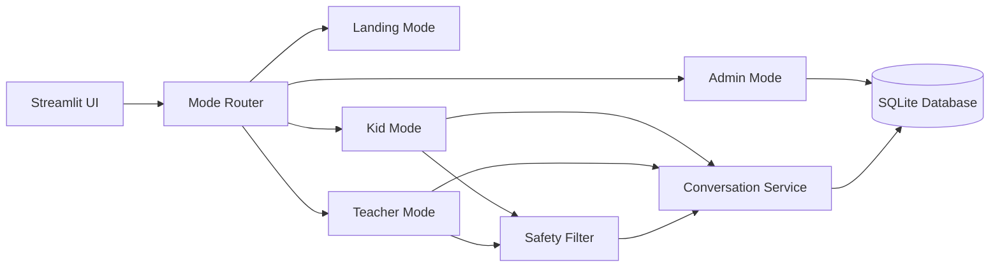

# KinderAi Product and Architecture Notes

KinderAi is a modular AI learning assistant for the **MajuBarengAi programme by Hacktiv8 with Google**.

## Purpose

The goal is to provide a safe learning assistant that can support:

- simple question answering,
- curated knowledge retrieval,
- lesson planning,
- quiz generation,
- basic progress tracking,
- and admin supervision.

## Design principles

### 1. Shared backend
All modes use the same core logic so behavior stays consistent.

### 2. Mode-specific UI
Each audience gets a different screen and different response style.

### 3. Safe defaults
Child-facing flows should stay short, clear, and filtered.

### 4. Configuration by environment
Secrets and environment-specific values should live outside the code.

### 5. Simple local persistence
SQLite is enough for the starter stage and keeps setup easy.

## Current architecture



## Key modules

- `app/main.py` handles the Streamlit entry point.
- `app/config.py` reads and validates environment settings.
- `app/core/router.py` selects the right UI mode.
- `app/core/conversation.py` contains the Gemini stub and response formatting.
- `app/core/safety/` contains prompt safety helpers.
- `app/db/database.py` wraps SQLite access.
- `app/modes/` contains the visible screens.

## Gemini API key stub

The repository uses a safe placeholder by default:

```dotenv
GEMINI_API_KEY=stub-gemini-api-key
GEMINI_USE_STUB=true
```

This is deliberate. It allows development and demo work without exposing a real secret. Later, the same setting can be replaced with a real provider adapter without changing the rest of the app.

## Data flow

1. The user opens a mode from the sidebar.
2. The mode screen receives the shared settings object.
3. The conversation service generates a response.
4. The response is logged to SQLite.
5. Admin mode can review recent activity and progress.

## Suggested build order

1. Landing page
2. Kid mode
3. Teacher mode
4. SQLite logging
5. Safety filtering
6. Admin review screen
7. Retrieval, quiz, and speech features

## Why this structure works

The app stays easy to understand because each folder has one job. The Streamlit screens remain thin, and the core logic stays testable.

## Suggested next expansion

- Replace stub responses with a real Gemini client adapter.
- Add retrieval over trusted lesson content only.
- Add tests for safety rules and database writes.
- Add exportable reports for teachers and admins.

## Notes for contributors

Keep the code small and readable. Prefer explicit functions over hidden side effects. Store secrets outside the repository. Document any new environment variables in both `README.md` and `.env.example`.
